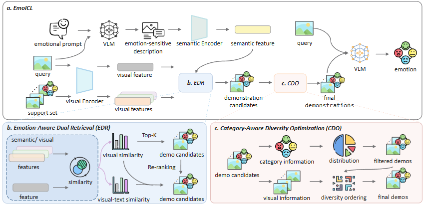

# EmoICL

**EmoICL: Enhancing Visual Emotion Recognition with Emotion-Aware In-Context Learning** — 官方实现（this repository）。

## Framework

<p align="center">
  
</p>

<!-- ## Overview

EmoICL performs **image-to-text in-context learning (ICL)** for visual emotion recognition: an **emotion-aware** pipeline retrieves support examples (fixed **whole** strategy: visual similarity, cross-modal reranking, MMR diversity), then prompts **vision–language models** with those in-context pairs to predict emotion categories.

**Supported datasets:** `EmotionROI`, `ArtPhoto`, `EmoSet` (EmoSet support size via `--exp_scale`: `support_100.json` / `support_1000.json` / `support_10000.json` when applicable).

**Supported backends (`--engine`):** `qwen-vl`, `llava-onevision-0.5b`, `llava-onevision-7b`, `idefics-9b-instruct`, `otter-llama`.

## Repository layout

| Path | Description |
|------|-------------|
| `inference.py` | Main ICL inference; writes `{resultDir}/{Dataset}_whole/*.json`. |
| `evaluate.py` | Loads predictions and runs semantic accuracy (`evals/eval.py`). |
| `utils/` | Data loading, whole-strategy retrieval (`ICL_utils.py`), VLM loading and decoding. |
| `blip/` | Optional: BLIP-2 captions on `query.json` (`generate_description.py`), CLIP cross-modal sim (`create_vt_sim.py`). |
| `clip/` | Optional: CLIP-style image features / similarities (`create_sim.py`; edit paths inside script). |
| `getExample.py` | Debug: copy retrieved support images for selected query IDs. |
| `run_*.sh` | Batch examples per model family. |
| `img/` | Figures (`main_icl.png` framework overview). |

## Data preparation

Expected layout under your `--dataDir` (default in code points to a local `DataSet/` tree; **change paths** for your machine):

```text
{Dataset}/
  query.json
  support.json                    # or support_10000.json for EmoSet + exp_scale
  query/
    query_image_features.pkl
  support/
    support_image_features.pkl
  similarity/
    image_image_similarity.pkl
    clip_text_image_similarity.pkl
```

Generate image features / image–image similarity with your own or provided **`clip/create_sim.py`** (hardcoded paths must be updated), then align filenames and subfolders with `inference.py` defaults or adjust CLI flags.

**Cross-modal similarity (`clip_text_image_similarity.pkl`):** optional flow — (1) `python blip/generate_description.py --datasets ...` to add `description` to **query**; (2) `python blip/create_vt_sim.py --datasets ...` (requires consistent `query.json` / `support.json`). If scripts write PKLs under the dataset root, move them into **`similarity/`** to match `utils/ICL_utils.py`.

## Dependencies

- Python 3.10+, CUDA, PyTorch, `transformers`, `tqdm`, `Pillow`, `numpy`, …
- Evaluation: `sentence-transformers`, `scikit-learn` (see `evals/eval.py`).
- Otter / LLaVA / Qwen / Idefics: follow `utils/load_models.py` and `sys.path` in `inference.py` for local code and checkpoints.

## Run

```bash
# Inference
python inference.py --dataset EmotionROI --engine otter-llama --n_shot 1 2 4 \
  --dataDir /path/to/DataSet --resultDir /path/to/ICL_log

# Evaluation (match score_weight / alpha_weight / seed / balance to output filenames)
python evaluate.py --dataset EmotionROI --engine otter-llama --n_shot 1 2 4 \
  --resultDir /path/to/ICL_log --seed 0 --balance_threshold 0.5 \
  --score_weight 0.7 --alpha_weight 0.6
```

## Citation

If you use this code, please cite the **EmoICL** paper (venue / BibTeX to be filled when published).

```bibtex
@article{emoicl2025,
  title   = {EmoICL: Enhancing Visual Emotion Recognition with Emotion-Aware In-Context Learning},
  author  = {},
  journal = {},
  year    = {2025}
}
```

Update the BibTeX entry with the official metadata from the camera-ready version.

## License

Add a `LICENSE` file if you distribute this repository publicly. -->
